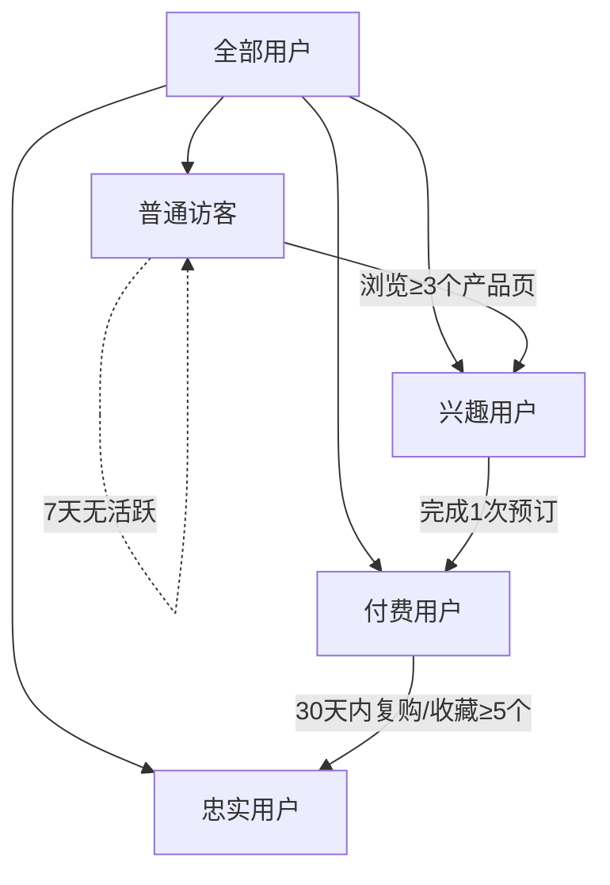

# RotoruaNZ 运营支持 · 营销执行 · 数据驱动持续优化

> 落地方案文档  
> 版本：v1.0 | 2026-06-28  
> 基于：新西兰.md（需求分析）+ 项目进度（已实现 Part 1-7）+ 优化计划（Phase 1-3）  
> 对应交付要求：**运营支持、营销执行与数据驱动的持续优化**

---

## 目录

1. [现状盘点](#1-现状盘点)
2. [运营支持](#2-运营支持)
3. [营销执行](#3-营销执行)
4. [数据驱动持续优化](#4-数据驱动持续优化)
5. [阶段实施路线图](#5-阶段实施路线图)
6. [附录：工具与技术选型](#6-附录工具与技术选型)

---

## 1. 现状盘点

### 1.1 已完成（小程序端）

| 模块 | 状态 | 说明 |
|:----|:----:|:-----|
| 首页 + 5个子页面 | ✅ | 航班/活动/路线/招商/租车全部双语 |
| 20个产品详情页 | ✅ | 完整转化链路（首页→详情→预订→成功） |
| 互动地图（Leaflet） | ✅ | 31个标注点 + 8类筛选 + 导航跳转 |
| 特色文化 Tab | ✅ | 2篇毛利故事 + 8件文化商品 |
| 个人中心 | ✅ | 收藏/订单/统计 + 三分类收藏展示 |
| 中英文切换 | ✅ | 全站 t()/td()/tc() 三级翻译体系 |
| 收藏系统 | ✅ | 全局 Provider + localStorage 持久化 |
| 后台管理系统 | ✅ | 独立 HTML，CRUD + 数据持久化全部就绪 |

### 1.2 待补齐（运营/营销/数据层）

| 方向 | 缺失项 | 优先级 |
|:----|:-------|:------:|
| 运营 | 微信生态多渠道接入 | P0 |
| 运营 | 私域用户运营体系 | P1 |
| 运营 | 内容日历+素材库 | P1 |
| 营销 | KOL 合作管理闭环 | P0 |
| 营销 | 活动营销引擎 | P1 |
| 营销 | 裂变传播机制 | P1 |
| 数据 | 用户行为采集 | P0 |
| 数据 | 数据看板 & 转化漏斗 | P0 |
| 数据 | A/B 测试框架 | P2 |

### 1.3 核心差距分析

```
当前状态：
  内容输出 ───→ 小程序展示 ───→ 预订 ───→ 无追踪
                                          ↑ 到这里就断了

目标状态：
  内容输出 → 多渠道分发 → 小程序承接 → 预订转化 → 数据追踪 → 优化迭代
                                                          ↓
                                             私域留存 → 复购
```

**最大缺口在"追踪→优化"的闭环上。** 内容有人发、小程序有人看、预订能走通，但不知道谁看了、从哪里来的、哪个渠道转化好、哪些产品卖不动。

---

## 2. 运营支持

### 2.1 微信生态矩阵搭建

#### 2.1.1 公众号 × 小程序联动

**策略**：公众号做内容沉淀和流量入口 → 小程序做交易转化

```
公众号推文 ───→ 嵌入小程序卡片/二维码 ───→ 用户扫码进入小程序 ───→ 预订转化
       ↕                                        ↕
  图文内容（攻略/游记/文化故事）              承接落地页
```

**落地动作**：

| 动作 | 频率 | 执行人 | 工具 |
|:----|:----:|:------|:-----|
| 每周1篇"目的地攻略"推文 | 周1次 | 小编 | 公众号后台 + Canva排版 |
| 推文嵌入小程序卡片 | 每篇 | 小编 | 微信后台「小程序卡片」组件 |
| 公众号菜单挂小程序 | 一次性 | 开发 | 公众号后台-自定义菜单 |
| 关键词回复引导 | 一次性 | 运营 | 公众号自动回复设置 |
| 关注后首条消息推小程序 | 一次性 | 运营 | 公众号-被关注回复 |

**关键指标**：公众号→小程序跳转率 ≥ 8%

#### 2.1.2 视频号 × 小程序联动

**策略**：短视频种草 → 直播间转化

```
视频号短视频 ──→ 挂载小程序链接 ──→ 用户点击进入产品页
                    ↓
            视频号直播 ──→ 小风车挂小程序 ──→ 实时转化
```

**落地动作**：

| 动作 | 频率 | 说明 |
|:----|:----:|:-----|
| 每周2条目的地短视频 | 周2条 | 景点实拍/KOL素材混剪 |
| 视频评论区置顶小程序链接 | 每篇 | 引导用户"点链接预订" |
| 直播时小风车挂小程序 | 每月1次 | 配合促销活动 |
| 视频号主页挂小程序 | 一次性 | 长期流量入口 |

**关键指标**：视频→小程序点击率 ≥ 3%

#### 2.1.3 线下触点标准化

**覆盖场景**：

| 场景 | 物料 | 放置位置 |
|:----|:-----|:---------|
| 新西兰机场 | 易拉宝/桌贴 | 到达大厅/旅游信息中心 |
| 罗托鲁瓦酒店前台 | 立牌+卡片 | 前台桌面/房间内提示卡 |
| 景点入口 | 扫码立牌 | 售票处/排队区 |
| 合作餐厅 | 桌贴+餐垫 | 桌面明显位置 |
| 旅行社门店 | 宣传单 | 资料架 |

**物料设计规范**：

```
┌─────────────────────────────────┐
│  📱 扫码发现真正的罗托鲁瓦        │
│                                 │
│     [QR CODE]                    │
│                                 │
│  温泉·毛利文化·探险               │
│  一键预订 · 中文导游              │
│                                 │
│  罗托鲁瓦旅游局官方小程序          │
└─────────────────────────────────┘
```

- 二维码 = 小程序码（带参数，可追踪来源）
- 尺寸建议：至少 3cm × 3cm
- 颜色：使用 Rotorua 品牌色（深绿 + 金色）

### 2.2 私域用户运营体系

#### 2.2.1 用户分层模型

基于微信生态可采集的数据，做四层用户分层：



**各层定义与运营动作**：

| 层级 | 定义 | 占比例 | 运营动作 |
|:----|:-----|:------:|:---------|
| 普通访客 | 进入小程序但浏览 < 3页 | ~60% | 推送优惠弹窗+引导浏览热门产品 |
| 兴趣用户 | 浏览 ≥ 3个产品页 或 收藏 ≥ 1个 | ~25% | 推送同类产品推荐+降价提醒 |
| 付费用户 | 完成 ≥ 1 次预订 | ~10% | 推送复购优惠券+邀评 |
| 忠实用户 | 30天内复购 或 收藏 ≥ 5个 | ~5% | 专属客服+新品首发+老客折扣 |

#### 2.2.2 触达通道

在小程序生态内可用的触达方式：

| 通道 | 特点 | 适用场景 |
|:----|:-----|:---------|
| 订阅消息（一次性） | 用户授权后可发1条 | 订单状态变更、支付提醒 |
| 订阅消息（长期） | 用户授权后可长期发送 | 促销活动、新品上线 |
| 客服消息 | 48h内可回复 | 咨询转化、售后 |
| 小程序浮窗 | 展示在页面边缘 | 活动入口、优惠券领取 |
| 公众号模板消息 | 通过公众号发送 | 每周推荐内容 |

#### 2.2.3 用户生命周期维护

```
获取 ──→ 激活 ──→ 留存 ──→ 转化 ──→ 复购
 │                                   │
 └────────── 流失召回 ←──────────────┘
```

**各阶段运营动作**：

| 阶段 | 触发条件 | 动作 | 频次 |
|:----|:---------|:-----|:----:|
| 激活 | 首次进入小程序 | 弹窗引导：推荐3个热门产品 | 1次 |
| 激活 | 浏览第3个产品页 | 弹窗提示收藏/订阅 | 1次 |
| 留存 | 7天未访问 | 公众号推"本周最受欢迎景点" | 周1次 |
| 留存 | 14天未访问 | 推送优惠券（满减/折扣） | 1次 |
| 转化 | 浏览预订页但未提交 | 24h后推送提醒 | 1次 |
| 复购 | 订单完成7天后 | 推送相关目的地推荐 | 1次 |
| 流失 | 30天未访问 | 推送"回来看看，有新内容" | 月1次 |

### 2.3 内容日历 + 素材库

#### 2.3.1 年度内容日历框架

```
             Q1              Q2              Q3              Q4
         ┌─────────────────────────────────────────────────────────┐
主题节庆   │  春节出游指南   清明节特惠      暑期大促       国庆黄金周   │
         │  冬季温泉季     毛利新年      户外探险季     圣诞新年    │
         └─────────────────────────────────────────────────────────┘
内容形式  │  攻略文章       短视频+图文    直播带逛       年度盘点    │
         │  KOL评测        用户故事      Vlog         预告片      │
KOL合作  │  生活方式类      旅行博主      户外KOL        家庭亲子   │
         │  KOC口碑        美食博主      极限运动博主    全家出行   │
活动      │  春节限定套餐    春日赏景      暑期亲子套餐   圣诞晚宴   │
         │  温泉季卡       毛利文化节    徒步挑战赛     跨年庆典    │
```

#### 2.3.2 月度执行清单模板

| 周次 | 内容输出 | 渠道 | KOL动作 | 数据复盘 |
|:----|:---------|:-----|:--------|:---------|
| 第一周 | 攻略文章×1 + 短视频×1 | 公众号+视频号 | KOL合作启动 | 上周数据 |
| 第二周 | 用户故事×1 | 公众号 | KOL内容发布 | 活动数据 |
| 第三周 | 短视频×2 | 视频号+小红书 | KOC铺量 | 渠道对比 |
| 第四周 | 月度盘点 | 公众号 | 效果汇总 | ROI计算 |

#### 2.3.3 素材库管理

**素材分类**：

```
素材库/
├── 图片/
│   ├── 景点/          # 各景点原图+压缩图
│   ├── 文化/          # 毛利文化相关
│   ├── 产品/          # 8件文化商品
│   ├── 品牌/          # Logo/VI/横幅
│   └── 用户/          # UGC 素材（已授权）
├── 视频/
│   ├── 官方/          # 官方拍摄
│   ├── KOL/           # 合作KOL素材
│   ├── B-roll/        # 空镜/备用素材
│   └── Reels/         # 短视频（15-60s）
├── 文案/
│   ├── 产品描述/       # 中英双语
│   ├── 活动文案/       # 促销/slogan
│   ├── 社交媒体/       # 推文/帖文模板
│   └── FAQ/           # 常见问题
└── 模板/
    ├── 推文模板/       # 公众号排版
    ├── 卡片模板/       # 小程序卡片设计
    └── 海报模板/       # 活动海报 PSD
```

**管理工具**：Notion / 飞书多维表格（免费，支持标签+搜索+协作）

---

## 3. 营销执行

### 3.1 KOL 合作管理体系

#### 3.1.1 KOL 分级

| 层级 | 粉丝量 | 单篇报价参考 | 合作目标 | 数量管理 |
|:----|:------:|:-----------:|:---------|:--------:|
| S级 | 100w+ | ¥30,000-80,000 | 品牌曝光+背书 | 每季1-2位 |
| A级 | 30-100w | ¥8,000-25,000 | 流量+转化 | 每月2-3位 |
| B级 | 5-30w | ¥2,000-8,000 | 精准转化 | 每周1-2位 |
| C级(KOC) | 5w以下 | 产品置换/¥500-2,000 | 口碑铺量 | 每月5-10位 |

#### 3.1.2 KOL 合作全流程

```
┌──────────┐    ┌──────────┐    ┌──────────┐    ┌──────────┐    ┌──────────┐
│   筛选   │──→│   邀约   │──→│   内容   │──→│   发布   │──→│   结算   │
│          │    │          │    │   共创   │    │   追踪   │    │   复盘   │
└──────────┘    └──────────┘    └──────────┘    └──────────┘    └──────────┘
     │              │              │              │              │
     ↓              ↓              ↓              ↓              ↓
 平台筛选      合作意向      内容审核      实时追踪      ROI报告
 风格匹配      报价谈判      二次修改      数据收集      逾期跟进
 数据核查      排期确认      发布计划      效果统计      归档入池
```

#### 3.1.3 KOL 内容分发矩阵

| 平台 | 内容类型 | 适合KOL级别 | 小程序的承接页面 |
|:----|:---------|:-----------:|:----------------|
| 小红书 | 图文+短文 | A/B/C | 文化故事页/产品详情 |
| 抖音 | 短视频+直播 | S/A/B | 景点详情/预订页 |
| 微信视频号 | 短视频+直播 | S/A | 首页+地图 |
| 微信公众号 | 长文 | A/B | 文化故事页 |
| 微博 | 短文+图 | S | Banner/首页 |
| 马蜂窝/携程 | 攻略 | B/C | 路线推荐页 |

#### 3.1.4 KOL 内容→小程序转化路径设计

以小红书为例：

```
用户在小红书看到KOL笔记
        ↓
   笔记中插入小程序码/链接
        ↓
   扫描/点击 → 微信 → 小程序
        ↓
   落地页：KOL专属承接页
     （顶部标明"XX博主同款推荐"）
        ↓
   浏览 → 收藏 → 预订
        ↓
   通过小程序渠道参数追踪转化
```

**关键**：每个 KOL 使用**唯一渠道参数**（小程序 scene 参数或二维码带参），追踪每个 KOL 的引流效果和转化率。

### 3.2 活动营销引擎

#### 3.2.1 活动类型库

| 类型 | 目标 | 形式 | 频率 |
|:----|:-----|:-----|:----:|
| 限时折扣 | 快速转化 | 产品价格限时下调+倒计时 | 月1-2次 |
| 满减优惠 | 客单价提升 | 满 ¥1000 减 ¥100 | 季1次 |
| 早鸟特惠 | 提前锁定 | 提前30天预订享7折 | 持续 |
| 套餐组合 | 交叉销售 | 温泉+毛利餐+住宿打包 | 月更 |
| 秒杀活动 | 拉新+活跃 | 每天1款特价 | 日更可选 |
| 拼团 | 裂变引流 | 2人成团享优惠 | 月1次 |
| 签到打卡 | 留存提升 | 签到7天得优惠券 | 持续 |

#### 3.2.2 活动上线 SOP

```
活动策划（D-14）
  ├── 确定活动目标与KPI
  ├── 选定产品+定价
  └── 设计活动页面/弹窗
      │
活动准备（D-7）
  ├── 内容素材准备（海报/文案/推文）
  ├── 小程序功能配置（优惠券/倒计时）
  └── KOL合作确认+排期
      │
活动预热（D-3 ~ D-1）
  ├── 公众号推文预告
  ├── 视频号短视频预热
  └── 私域群发预告
      │
活动上线（D-Day）
  ├── 小程序首页Banner/弹窗上线
  ├── 全渠道同步推广
  └── 实时监控数据
      │
活动复盘（D+1 ~ D+3）
  ├── 数据汇总（GMV/UV/转化率/ROI）
  ├── 效果评估 vs 预设KPI
  └── 经验文档化
```

#### 3.2.3 小程序内活动组件清单

| 组件 | 说明 | 复杂度 |
|:----|:-----|:------:|
| 倒计时 | 显示剩余时间 | ★☆☆ |
| 优惠券弹窗 | 弹出领取优惠券 | ★★☆ |
| 限时标签 | 产品卡片上"限时优惠"角标 | ★☆☆ |
| 活动Banner | 首页Banner轮播活动图 | ★☆☆ |
| 活动专区页 | 独立活动页，展示活动产品 | ★★☆ |
| 拼团组件 | 2人成团逻辑 | ★★★ |
| 秒杀倒计时 | 整点秒杀+库存显示 | ★★★ |

### 3.3 裂变传播机制

#### 3.3.1 分享激励

| 分享方式 | 激励 | 实现方式 |
|:---------|:-----|:---------|
| 分享给好友 | 双方各得优惠券 | 小程序分享API + 参数传递 |
| 海报分享朋友圈 | 集赞得优惠 | 生成分享海报+小程序码 |
| 邀请注册 | 邀请人得积分 | 基于unionid的邀请关系绑定 |

#### 3.3.2 小程序分享优化

```javascript
// 分享卡片优化方案
wx.showShareMenu({
  withShareTicket: true,
  menus: ['shareAppMessage', 'shareTimeline']
})

// 自定义分享内容
Page({
  onShareAppMessage() {
    return {
      title: '我在罗托鲁瓦发现了这个！',  // 个性化标题
      path: `/pages/detail/index?id=${productId}&ref=share`,
      imageUrl: shareImage,  // 自定义分享图
      desc: '温泉·毛利文化·探险，扫码发现真正的罗托鲁瓦'
    }
  }
})
```

**分享卡片设计规范**：

```
┌──────────────────┐
│                  │
│   [产品主图]      │  ← 800×600 清晰大图
│                  │
│  "我在罗托鲁瓦    │
│   发现了这个！"   │  ← 吸引人但不标题党
│                  │
│  蒂普亚毛利文化村  │
│  地热喷泉+毛利表演 │
│  ¥299起           │  ← 价格信息清晰
│                  │
│  微信小程序 · 罗托鲁瓦旅游局 │
└──────────────────┘
```

---

## 4. 数据驱动持续优化

### 4.1 用户行为采集体系

#### 4.1.1 事件埋点规范

**用户行为事件定义**（当前小程序已具备埋点能力，需补充采集逻辑）：

| 事件ID | 事件名称 | 触发时机 | 附带参数 |
|:-------|:---------|:---------|:---------|
| `page_view` | 页面浏览 | 进入任意页面 | `page_path`, `page_title`, `lang` |
| `product_view` | 产品浏览 | 进入产品详情页 | `product_id`, `product_name`, `category` |
| `product_fav` | 产品收藏 | 点击收藏/取消收藏 | `product_id`, `action`(add/remove) |
| `booking_start` | 开始预订 | 进入预订页 | `product_id`, `product_name` |
| `booking_submit` | 提交预订 | 提交预订表单 | `product_id`, `date`, `persons`, `price` |
| `booking_success` | 预订成功 | 预订成功页展示 | `order_id`, `product_id`, `total` |
| `map_interact` | 地图交互 | 点击地图标注点 | `point_id`, `point_type` |
| `search_query` | 搜索 | 提交搜索 | `query`, `result_count` |
| `share` | 分享 | 触发分享 | `share_type`(friend/timeline), `product_id` |
| `promo_click` | 活动点击 | 点击活动入口 | `promo_id`, `promo_type` |
| `user_register` | 用户注册/登录 | 完成登录 | `login_type`(wechat/phone) |

#### 4.1.2 渠道追踪参数规范

所有外部流量入口携带渠道参数：

```javascript
// 小程序 scene 参数规范
// scene 格式: channel_source_medium_campaign

// 示例
scene = "kol_小红书的旅行日记_adventure_campaign01"
//         ↑      ↑               ↑        ↑
//      渠道   来源            媒介      活动标识

// 渠道标识对照表
const CHANNEL_MAP = {
  kol:  'KOL合作',
  ads:  '付费广告',
  off:  '线下扫码',
  soc:  '社交媒体',
  sea:  '搜索引擎',
  dir:  '直接访问',
  eml:  '邮件营销',
  ref:  '推荐/裂变'
}
```

#### 4.1.3 数据存储方案

**阶段一（MVP）**：本地 + 后台统计

```
小程序端 → localStorage 记录事件日志 → 后台管理员手动导入查看
                                       ↓
                                 局限性：只能看聚合数据
                                 无法做用户级分析
```

**阶段二（上量）**：轻量后端 + 分析服务

```
小程序端 → Supabase/LeanCloud → 数据看板
              ↓
        自动生成日报/周报
              ↓
        支持漏斗分析/留存分析
```

**推荐**：阶段一先用简单的 **localStorage + 后台统计面板**，等验证了需求走通后再上后端。

### 4.2 数据看板设计

#### 4.2.1 数据看板结构

```
┌─────────────────────────────────────────────────────────────┐
│  概览仪表盘                                                    │
│  ┌──────┐ ┌──────┐ ┌──────┐ ┌──────┐ ┌──────┐             │
│  │ 今日UV│ │ 昨日UV│ │本月GMV│ │转化率 │ │ 客单价│             │
│  │ 1,284│ │ 2,156│ │¥35,680│ │ 3.2% │ │¥892 │             │
│  └──────┘ └──────┘ └──────┘ └──────┘ └──────┘             │
│  ┌────────────────────────────────────────────────────┐     │
│  │ 近7日流量趋势（折线图）                                │     │
│  │  📈 2,500 ┤                                            │     │
│  │          ┤    ●2,156                                   │     │
│  │          │ ●1,984     ●1,872                          │     │
│  │ 1,500 ──┼─●─────●───────●─────●─────●─────            │     │
│  │          │    1,284   1,412 1,568  1,330               │     │
│  │          └──────────────────────────────────            │     │
│  │          22  23  24  25  26  27  28                   │     │
│  └────────────────────────────────────────────────────┘     │
└─────────────────────────────────────────────────────────────┘
```

**核心指标定义**：

| 指标 | 定义 | 计算方式 |
|:----|:-----|:---------|
| UV (Unique Visitor) | 独立访客数 | 按 openid 去重统计 |
| PV (Page View) | 页面浏览量 | 所有 page_view 事件计数 |
| 转化率 | 预订转化率 | booking_success / page_view × 100% |
| GMV | 总交易额 | 所有 booking_success 的 price 之和 |
| 客单价 | 平均交易额 | GMV / booking_success 数量 |
| 收藏率 | 产品收藏比例 | 收藏数 / product_view × 100% |
| 复购率 | 重复购买比例 | 多笔订单用户 / 总付费用户 × 100% |
| 留存率 | 用户留存 | 次周回访用户 / 周新增用户 × 100% |

#### 4.2.2 数据看板分页

**概览页**：
- 实时数据卡：今日UV/GMV/订单数/转化率
- 趋势图：近7/14/30天 UV 和 GMV 趋势
- Top 5 热门产品排行
- 渠道来源分布饼图

**流量分析页**：
- 页面 PV/UV 排行（哪个页面最热）
- 用户访问路径（从哪来→去了哪→在哪流失）
- 渠道来源对比（KOL/线下/公众号/自然流量）
- 时段分析（每天几点最多人访问）

**转化分析页**：
- 预订转化漏斗（浏览→详情→预订→支付→成功）
- 各产品转化率对比
- 各渠道转化率对比
- 弃单分析（在预订页放弃的用户都去了哪）

**用户分析页**：
- 新老用户占比
- 用户活跃度分布
- 地域分布（小程序可获取大致位置）
- 用户生命周期阶段分布

**营销分析页**：
- 活动效果对比
- KOL ROI 排行
- 优惠券核销率
- 各渠道获客成本

### 4.3 转化漏斗优化

#### 4.3.1 预订转化漏斗模型

```
                     流量层           ————→ 用户从何处来
                       │
                 进入小程序 100%
                       │
                  ↓
                   浏览产品页 52%      ← 48% 用户流失：首页内容不够吸引
                       │
                  ↓
                   查看详情 18%        ← 34% 用户流失：产品卡片吸引力不足
                       │
                  ↓
                   开始预订 6.5%       ← 11.5% 流失：详情页说服力不够
                       │
                  ↓
                   提交预订 3.8%       ← 2.7% 流失：预订表单太复杂
                       │
                  ↓
                   预订成功 3.2%       ← 0.6% 流失：支付环节问题
```

**各环节优化策略**：

| 环节 | 当前流失率 | 优化方向 | 预期提升至 |
|:----|:---------:|:---------|:---------:|
| 首页→浏览产品 | 48% | 热门产品轮播、个性化推荐、搜索栏优化 | 60%+ |
| 产品卡片→详情 | 65% | 图片吸引力、评分展示、标签高亮 | 55%+ |
| 详情→开始预订 | 64% | 添加用户评价、社交证明、紧迫感（限时/限量） | 50%+ |
| 预订→提交 | 42% | 简化表单、微信一键填充、增加支付方式 | 70%+ |
| 提交→成功 | 16% | 优化支付体验、错误引导 | 90%+ |

#### 4.3.2 A/B 测试框架

**可测试的变量**：

| 测试对象 | 变量A（当前） | 变量B（候选） |
|:---------|:-------------|:--------------|
| 首页Banner | 3张自动轮播 | 改为1张精美大图+下方3张缩略图 |
| 产品卡片 | 大图+名称+价格 | 大图+名称+评分+价差标 |
| 预订按钮 | "立即预订" | "限时优惠 立即抢购" |
| 预订流程 | 3步表单 | 单页精简表单 |
| 价格展示 | ¥299起 | ¥299/人（含...） |
| 图片风格 | 实拍风景 | 实拍+文字叠加 |

**A/B 测试执行流程**：

```
1. 假设 → "把预订按钮文字改为'限时优惠'，转化率提高10%"
2. 设置 → 50%用户看A，50%看B
3. 运行 → 至少采集1000个有效样本
4. 判定 → B转化率显著高于A → 全量切换
5. 归档 → 测试结论记入文档
```

### 4.4 数据驱动的内容优化

#### 4.4.1 内容效果评估矩阵

```
                  高互动
                    │
         ┌─────────┼─────────┐
         │  精品内容  │  潜力内容 │
         │  (充分曝光)│  (需推量) │
    低转换──┼─────────┼─────────┼──高转换
         │  弃坑内容  │ 流量内容 │
         │  (快放弃)  │  (需优化) │
         └─────────┼─────────┘
                    │
                  低互动
```

**各类内容运营动作**：

| 类型 | 特征 | 运营策略 |
|:-----|:-----|:---------|
| 精品内容 | 高互动+高转化 | 加大推广、做系列延续、二次创作素材 |
| 潜力内容 | 高互动+低转化 | 优化转化路径、增加CTA、加小程序链接 |
| 流量内容 | 低互动+高转化 | 改善标题/封面、加大曝光、找问题 |
| 弃坑内容 | 低互动+低转化 | 分析原因、替换方向、不再投入 |

#### 4.4.2 每周数据复盘模板

```
【数据周报】Week 28 (2026-07-06 ~ 07-12)

━━ 流量概览 ━━━━━━━━━━━━━━━━━━
总UV: 12,847 (↑15% vs WoW)
总PV: 38,560 (↑12% vs WoW)
日均停留: 2分48秒 (↓5%)

━━ 转化表现 ━━━━━━━━━━━━━━━━━━
预订数: 412 (↑8%)
GMV: ¥367,880 (↑22%)
转化率: 3.2% (↑0.3pp)
客单价: ¥893 (↑14%)

━━ 渠道来源 ━━━━━━━━━━━━━━━━━━
直接访问: 45%
公众号引流: 22% (↑5pp)
线下扫码: 15%
KOL引流: 12% (↓2pp)
其他: 6%

━━ 热门产品 Top 5 ━━━━━━━━━━━
1. 波利尼西亚温泉 (转化率5.2%)
2. 蒂普亚文化体验 (转化率4.8%)
3. 怀奥塔普地热 (转化率4.1%)
4. Hangi大地晚餐 (转化率3.6%)
5. 红木森林徒步 (转化率2.9%)

━━ 本周问题 ━━━━━━━━━━━━━━━━━━━
1. KOL引流下降 → 原因：上周无新合作发出
2. 日均停留下降 → 原因：首页内容未更新
3. 预订页弃单率 ↑ → 待分析

━━ 下周计划 ━━━━━━━━━━━━━━━━━━━
1. 上线「冬季温泉季」活动
2. 新增2位KOL合作发布
3. 优化预订表单（精简为单页）
4. 更新首页内容
```

---

## 5. 阶段实施路线图

### 5.1 三阶段总览

```
Phase A: 基础运营支撑 (第1-2周)
  ┌──────────────────────┐
  │ 任务量：轻度开发      │
  │ 重点：渠道接入+埋点   │
  │ 投入：1-2人           │
  └──────────────────────┘
          ↓
Phase B: 营销体系搭建 (第3-6周)
  ┌──────────────────────┐
  │ 任务量：中度开发      │
  │ 重点：活动引擎+KOL    │
  │ 投入：2-3人           │
  └──────────────────────┘
          ↓
Phase C: 数据驱动成熟 (第7-12周)
  ┌──────────────────────┐
  │ 任务量：迭代优化      │
  │ 重点：自动化&优化     │
  │ 投入：1-2人           │
  └──────────────────────┘
```

### 5.2 Phase A：基础运营支撑（第1-2周）

| # | 任务 | 产出 | 工时 | 依赖 |
|:-:|:-----|:-----|:----:|:----:|
| A1 | 公众号×小程序联动策略文档 | 配置指南 | 1天 | - |
| A2 | 公众号菜单/自动回复配置 | 已配置 | 0.5天 | A1 |
| A3 | 线下物料设计规范+模板 | 设计稿 | 2天 | - |
| A4 | 小程序埋点事件接入 | 事件日志 | 2天 | 现有代码 |
| A5 | 渠道参数标准定义 | 参数规范文档 | 0.5天 | - |
| A6 | 用户行为数据看板（后台管理版） | 看板页面 | 2天 | A4 |
| A7 | 内容日历第一版（至年底框架） | 日历文档 | 1天 | - |
| A8 | 素材库搭建（Notion/飞书） | 素材库 | 1天 | - |

**Phase A 小计：约 10 个工作日**

### 5.3 Phase B：营销体系搭建（第3-6周）

| # | 任务 | 产出 | 工时 | 依赖 |
|:-:|:-----|:-----|:----:|:----:|
| B1 | KOL 合作管理模块（后台） | 管理页面+数据 | 2天 | A6 |
| B2 | 活动营销引擎（优惠券/倒计时/专区） | 前端组件 | 4天 | - |
| B3 | 用户分层标签系统 | 分类逻辑+展示 | 2天 | A4 |
| B4 | 订阅消息接入 | 消息模板 | 2天 | 微信审核 |
| B5 | KOL 首批合作执行（3-5位） | 合作完成 | 2周 | B1 |
| B6 | 首次活动策划+上线 | 活动完成 | 1周 | B2 |
| B7 | 分享裂变优化（卡片+激励） | 分享组件 | 2天 | - |

**Phase B 小计：约 12-15 个工作日**

### 5.4 Phase C：数据驱动成熟（第7-12周）

| # | 任务 | 产出 | 工时 | 依赖 |
|:-:|:-----|:-----|:----:|:----:|
| C1 | 转化漏斗可视化 | 漏斗图+分析 | 2天 | A6 |
| C2 | A/B 测试框架搭建 | 测试引擎 | 3天 | A4 |
| C3 | 自动日报/周报生成 | 报告模板+自动化 | 2天 | A6 |
| C4 | 用户留存分析模块 | 留存曲线图 | 2天 | B3 |
| C5 | 产品推荐系统（基于收藏+浏览历史） | 推荐组件 | 3天 | B3 |
| C6 | 首次 A/B 测试（预订按钮文案） | 测试报告 | 1周 | C2 |
| C7 | 内容效果分析模型 | 分析报告 | 2天 | B1+A7 |
| C8 | 运营流程文档化 | SOP手册 | 3天 | 全阶段 |

**Phase C 小计：约 16-20 个工作日**

### 5.5 投入与收益预估

```
              Phase A               Phase B               Phase C
              ┌─────────────────────────────────────────────┐
投入（人天）    │     10天                15天                18天              │
渠道流量       │  +15%                +35%                +50%              │
转化率         │  +0.5pp              +1.5pp              +3.0pp            │
GMV（月均）     │  +10%                +30%                +50%              │
用户留存（周）  │  维持                  +10%                +20%              │
              └─────────────────────────────────────────────┘
```

*注：以上数据为基于行业基准的预估，实际效果取决于执行力度和市场反馈。*

---

## 6. 附录：工具与技术选型

### 6.1 工具推荐

| 用途 | 推荐工具 | 费用 | 说明 |
|:-----|:---------|:----:|:-----|
| 数据埋点（轻量） | Umami / Plausible | 免费自建 | 尊重隐私的开源分析 |
| 数据埋点（重） | 微信小程序数据分析 | 免费 | 接入简单，数据准确 |
| 数据存储 | Supabase | 免费计划足够 | PostgreSQL+API |
| 数据看板 | Metabase | 免费自建 | 拖拽式数据可视化 |
| 内容管理 | 飞书多维表格 | 免费 | 飞书=日历+表格+知识库 |
| KOL管理 | 后台管理系统已有模块 | - | 当前代码已有骨架 |
| 流程图 | Excalidraw/Mermaid | 免费 | 流程文档化 |
| 设计稿 | Figma | 免费 | 素材库+物料设计 |
| 团队协作 | Notion / 飞书 | 免费 | 文档+日历+任务管理 |

### 6.2 技术选型理由

```
数据方案选择路径：

方案A：纯前端埋点 + localStorage + 后台手动汇总
  ✅ 零后端、零费用、最快上线
  ❌ 数据不精准、无用户级分析、无法做自动报告
  适用：Phase A 快速验证

方案B：Supabase + 前端 SDK
  ✅ 免费（每月 500MB 数据 + 2GB 存储）
  ✅ PostgreSQL 原生 SQL 查询能力
  ✅ 自带认证系统和实时订阅
  ✅ Web 控制台可直接做数据查询
  适用：Phase B 上线后

方案C：微信官方数据 + 自建分析
  ✅ 数据最准确（微信原生）
  ❌ 数据维度有限、导出不方便
  适用：与方案B互补使用
```

### 6.3 关键接口清单

小程序需要新增/修改的接口（仅为实现运营营销数据层所需）：

| 接口 | 用途 | 备注 |
|:-----|:-----|:-----|
| `wx.reportAnalytics()` | 上报自定义事件 | 微信原生，零成本 |
| `wx.getSetting()` | 检查用户授权 | 用于订阅消息 |
| `wx.requestSubscribeMessage()` | 请求订阅消息 | 需要微信审核通过 |
| `wx.shareAppMessage` | 自定义分享 | 小程序原生能力 |
| `wx.shareTimeLine` | 分享朋友圈 | 小程序原生能力 |
| `wx.getLocation()` | 获取大致位置 | 用于地域分布统计 |
| `wx.updateShareMenu()` | 动态更新分享菜单 | 用于裂变追踪 |

---

## 7. 优先级建议

```
立即动手（本周）
  ┌── A1 公众号×小程序联动配置    [30分钟]
  ├── A4 小程序事件埋点            [2天]
  ├── A6 数据看板（后台）          [2天]
  └── A7 内容日历框架              [1天]

下周
  ├── A3 线下物料设计规范          [2天]
  ├── B1 KOL管理模块上线           [2天]
  └── B7 分享裂变优化             [2天]

月底前
  ├── B2 活动营销引擎               [4天]
  ├── B3 用户分层                  [2天]
  └── B5 首批KOL合作执行           [2周]

持续迭代
  ├── C1-C8 数据驱动优化           [持续]
  └── 内容日历执行+复盘            [每周]
```

---

> **文档说明**  
> 此文档为运营支持·营销执行·数据驱动持续优化的完整落地方案。  
> 所有方案均基于小程序当前已实现的 Part 1-7 功能（产品数据双语完整、预订链路跑通、地图/文化/个人中心就绪）。  
> 下一阶段开发可直接参照 Phase A 优先级顺序推进。
>
> 版本：v1.0 | 2026-06-28 | 关联文件：新西兰.md、项目进度.md、优化计划.md、后端管理.md
